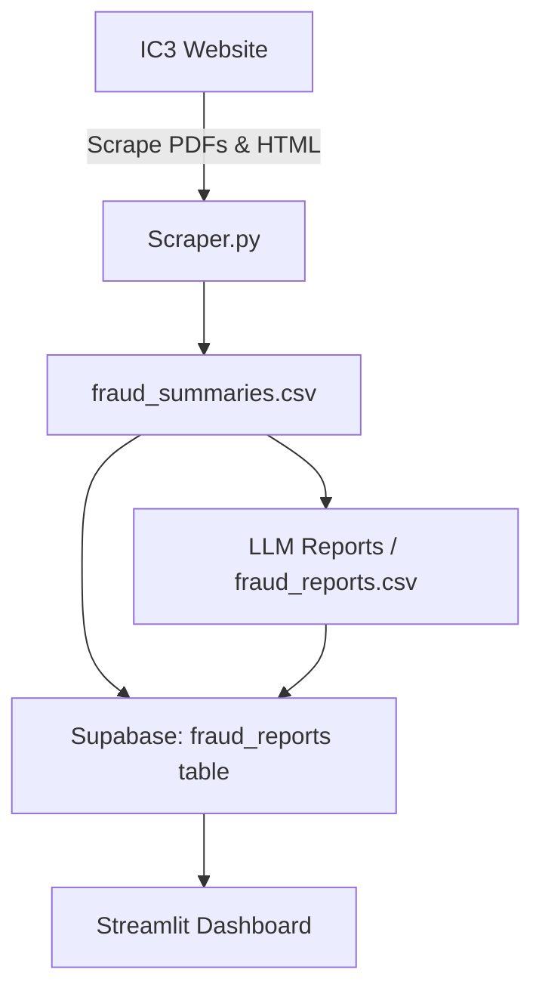

# Fraud Trends Dashboard
**Tagline:** Interactive AI-powered insights into fraud patterns from IC3 reports

## Authors
- Samuel McClure, Taylor Foster, Jayson Allman and Yousef Eddin  

## Project Summary
This project automates the collection, analysis, and summarization of fraud reports from IC3, enabling anyone to track trends, detect emerging threats, and generate actionable insights efficiently.

## Quick Start

Follow these steps to get the Fraud Analysis Dashboard running locally.

---

### 1. Clone the Repository
```bash
git clone https://github.com/JaysonAllman/DTSC-Fraud-Project.git
cd DTSC-Fraud-Project
```
### 2. Create a Virtual Environment and Install Dependencies
```bash
uv venv
source .venv/bin/activate   # Linux/Mac
.venv\Scripts\activate      # Windows
uv pip install -r requirements.txt
```

### 3. Setup Environment Variables
- Create a .env file and insert these:
- SUPABASE_URL=<your_supabase_url_here>
- SUPABASE_KEY=<your_supabase_anon_key_here>
- OPENAI_API_KEY=<your_openai_api_key_here>

### 4. Run the Streamlit Dashboard
```bash
uv run streamlit run app.py
```

## Architecture Diagram

The workflow of the **DTSC Fraud Analysis Project** is illustrated below. It shows the ETL pipeline from scraping IC3 webpages and PDFs, generating keyword summaries, storing data in Supabase, and visualizing trends on the Streamlit dashboard.




