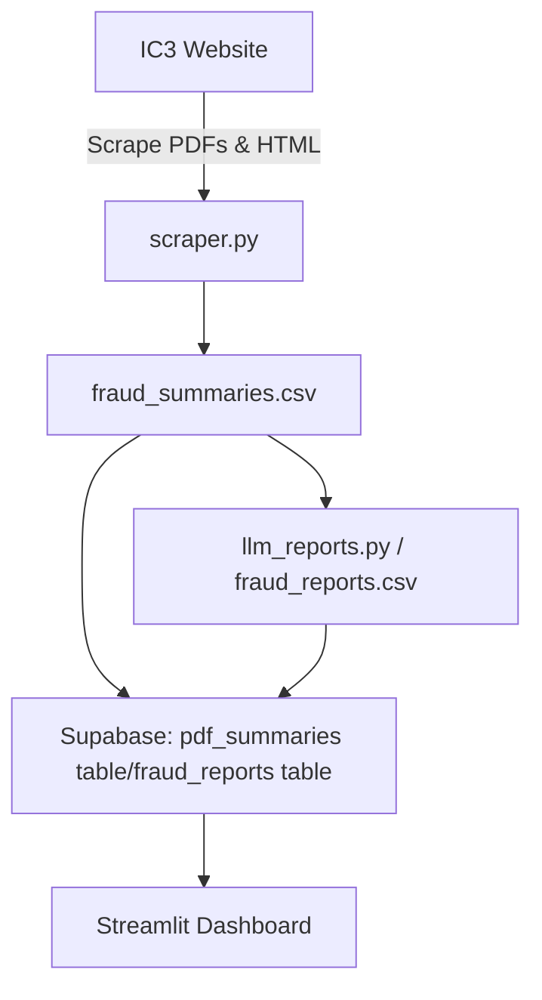

# Fraud Trends Dashboard
**Tagline:** Interactive AI-powered insights into fraud patterns from IC3 industry reports

## Authors
- Samuel McClure, Taylor Foster, Jayson Allman and Yousef Eddin  

## Project Summary
This project automates the collection, analysis, and summarization of industry reports from IC3, enabling anyone to track trends, detect emerging threats, and generate actionable insights efficiently.

## Quick Start

Follow these steps to get the Fraud Trends Dashboard running locally.

---

### 1. Clone the Repository
```bash
git clone https://github.com/JaysonAllman/DTSC-Fraud-Project.git
cd DTSC-Fraud-Project
```
### 2. Create a Virtual Environment and Install Dependencies
```bash
uv venv
source .venv/bin/activate   # Linux/Mac
.venv\Scripts\activate      # Windows
uv pip install -r requirements.txt
```

### 3. Setup Environment Variables
- Create a .env file and insert these:
- SUPABASE_URL=<your_supabase_url_here>
- SUPABASE_KEY=<your_supabase_anon_key_here>
- OPENAI_API_KEY=<your_openai_api_key_here>

### 4. Run the Streamlit Dashboard
```bash
uv run streamlit run app.py
```

## Architecture Diagram

The workflow of the **DTSC Fraud Trends Project** is illustrated below. It shows the ETL pipeline from scraping IC3 webpages and PDFs, generating keyword summaries, storing data in Supabase, and visualizing trends on the Streamlit dashboard.



## Folder structure
<pre>
DTSC-Fraud-Project/
├─ app.py                  # Streamlit dashboard
├─ scraper.py              # Scrapes IC3 PDFs & webpages
├─ keywords.py             # Fraud keyword dictionary & regex
├─ llm_reports.py          # Generates LLM summaries
├─ loader.py               # Uploads CSV data to Supabase
├─ requirements.txt        # Dependencies
├─ .env                    # Environment variables (not tracked)
└─ images/                 # Screenshots or GIFs
</pre>

## Data Transformation & Workflow
Overview
This project automates fraud detection analysis from IC3 reports using Python. The pipeline:

1. Scrapes PDFs and webpages to extract fraud reports.
2. Identifies keywords across reports using a dictionary.
3. Aggregates counts by fraud type and keyword over time.
4. Generates LLM summaries for each time period.
5. Displays results in a Streamlit dashboard with interactive filters and visualizations.

## Dashboard Example


## Example: Transforming Data
Example of Raw Data
**fraud_summaries.csv** (sample rows):

| id  | title               | date       | fraud_type_counts                    | keyword_counts                  |
|-----|--------------------|------------|-------------------------------------|--------------------------------|
| 1   | IC3 Report Jan 2023 | 2023-01-15 | {"Phishing": 10, "Malware": 5}      | {"smishing": 10, "trojan": 5} |
| 2   | IC3 Report Feb 2023 | 2023-02-10 | {"Extortion": 8, "Phishing": 4}     | {"blackmail": 8, "spearphishing": 4} |

**Aggregate fraud type counts across time periods**

```python
import pandas as pd

# Example data
df = pd.DataFrame([
    {"date": "2023-01-15", "fraud_type_counts": {"Phishing": 10, "Malware": 5}},
    {"date": "2023-02-10", "fraud_type_counts": {"Extortion": 8, "Phishing": 4}}
])

# Flatten fraud_type_counts
totals = {}
for d in df["fraud_type_counts"]:
    for k, v in d.items():
        totals[k] = totals.get(k, 0) + v

print(totals)
# Output: {'Phishing': 14, 'Malware': 5, 'Extortion': 8}
```

**Aggregate keyword counts**

```python
keyword_counts = []
for d in df["fraud_type_counts"]:
    for k, v in d.items():
        keyword_counts.append((k.lower(), v))

keyword_df = pd.DataFrame(keyword_counts, columns=["keyword", "count"])
keyword_summary = keyword_df.groupby("keyword").sum().reset_index()
print(keyword_summary)


Output:

keyword	count
smishing	14
trojan	5
blackmail  8
spearphishing  4
```

## Clear Findings

The **Fraud Trends Dashboard** enables organizations and analysts to **quickly identify trends, recurring fraud types, and emerging threats** over time without manually reading IC3 reports. By aggregating keyword occurrences and using AI-generated summaries, users can make data-driven decisions and detect patterns in cybercrime activities.

### Key Insights

- **Most Common Fraud Types:** The dashboard highlights the top fraud types per year, quarter, or All time, such as phishing, malware, and extortion.  
- **Keyword Trends:** Keyword aggregation allows tracking of specific fraud-related terms over time. For example, mentions of "phishing" increased from 14 in Jan–Feb 2023 to 170 in 2023 overall.  
- **LLM Summaries:** AI-generated narratives summarize large volumes of reports, highlighting significant patterns and emerging threats in a human-readable format.  

### Example Visual
**Analysis of All Time Fraud Trends**  


### Why It’s Useful

- Saves **hours of manual report reading** by summarizing key fraud trends automatically.  
- Provides **actionable insights** to security teams and analysts.  
- Supports **interactive filtering** by year, quarter, or All time ranges.  
- Enables **trend visualization** for presentations, reports, or monitoring.

https://dtsc-fraud-project-kzrjrxxgxdnc7kvanirkao.streamlit.app/
